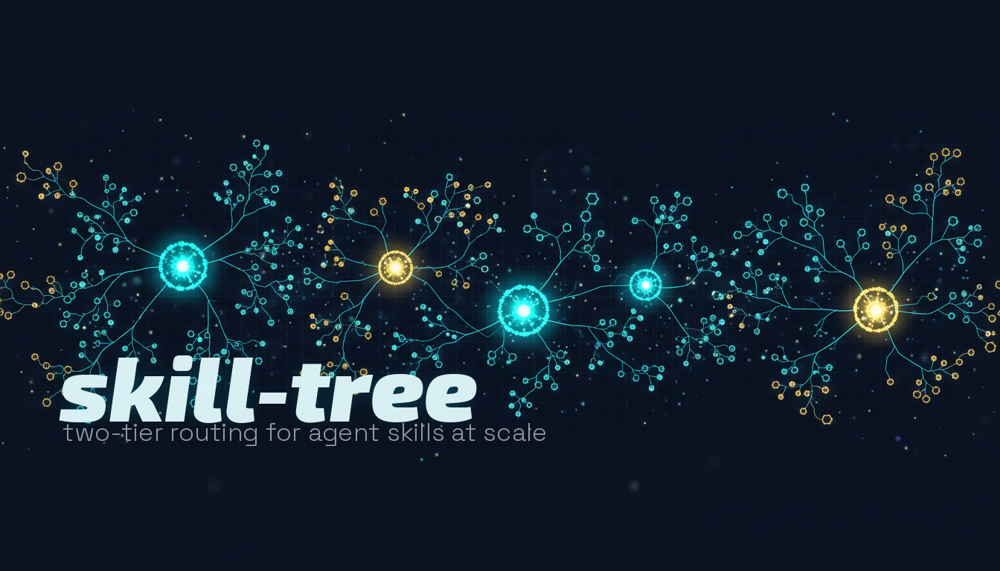

<p align="center">
  
</p>

# skill-tree

Agent skill platforms load every skill description into context at session start. Claude Code caps this at ~16K characters. At ~160 skills, descriptions get **silently dropped** — the model doesn't know they exist.

skill-tree fixes this. It groups your skills into clusters with routing tables. Instead of 160 skill descriptions in context, you get ~20 cluster descriptions. The model picks a cluster, then loads the right skill on demand.

```
Before: 163 skills × ~100 tokens = ~16,300 tokens (over budget, skills dropped)
After:   22 clusters × ~85 tokens =  ~1,876 tokens (88% reduction, nothing dropped)
```

## Install

Requires [Python 3.11+](https://www.python.org/) and [uv](https://docs.astral.sh/uv/).

**Claude Code:**
```bash
claude plugin marketplace add danielbrodie/skill-tree
claude plugin install skill-tree@skill-tree
```

**Gemini CLI:**
```bash
gemini extensions install https://github.com/danielbrodie/skill-tree
```

**OpenClaw:**
```bash
openclaw plugins install ./openclaw
```
Or from a clone: `git clone` the repo, then `openclaw plugins install ./skill-tree/openclaw`.

**Codex CLI** — no plugin system, use scripts directly:
```bash
git clone https://github.com/danielbrodie/skill-tree.git
cd skill-tree
uv run scripts/init.py --skills-dir ~/.codex/skills
uv run scripts/scan.py --skills-dir ~/.codex/skills
uv run scripts/sync.py --skills-dir ~/.codex/skills --codex
```

## Usage

Three commands:

| Command | What it does |
|---------|-------------|
| `/setup` | Detect your skills, cluster them, generate routing files |
| `/check` | Show health, clusters, and token savings |
| `/fetch <url>` | Add a skill from GitHub |

Run `/setup` after install. Run `/check` anytime to see status:

```
skill-tree — 163 skills managed

  Flat catalog:    ~16,300 tokens
  With skill-tree: ~1,876 tokens (88% reduction)

Clusters (22):
  research-index       5 leaves   Research — web search, deep research...
  dev-tools            8 leaves   Developer tools — GitHub, coding agents...
  ...

No errors.
```

A SessionStart hook runs `/check` automatically and alerts you if anything is wrong.

## How it works

**Two-hop routing:** The model sees cluster descriptions in its prompt. When it picks a cluster, it uses the `read` tool to load the cluster's SKILL.md, which contains a routing table. The routing table points to leaf skills by path. The model reads the right leaf and follows its instructions. Leaves have `disable-model-invocation: true` so they never appear in the prompt directly — they're only reachable through a cluster router.

```
~/.claude/skills/           ← cluster routers (what the model sees in prompt)
  research-index/SKILL.md   ← routing table: "use librarium for X, notebooklm for Y"
  dev-tools/SKILL.md

~/.claude/skills-library/   ← leaf skills (hidden from prompt, loaded via read)
  librarium/SKILL.md
  github-ops/SKILL.md
  skill-tree/manifest.json  ← source of truth
```

**manifest.json** defines the graph. `/setup` creates it, `/check` validates it. Cluster SKILL.md files are generated — edit the manifest, not the clusters.

**Manifest categories:** Beyond clusters and standalones, the manifest supports `hotPath` (skills that stay in the scan path and are always visible — e.g., your most-used skill), `referenceNodes` (utility skills with `disable-model-invocation` that are loaded explicitly by other skills, not routed), and `deprecated` (phased-out skills, hidden from catalog).

**Additive by default:** When a manifest already exists, `/setup` only adds new skills as standalones — it won't blow away your existing clusters or manual edits. Use `--full` to regenerate the entire structure from scratch.

**`/fetch` and sandboxing:** `/fetch` downloads skills from GitHub, shows you the full content, and runs security checks (prompt injection, zero-width unicode, path traversal). New skills are "sandboxed" — this means they get `disable-model-invocation: true` in their frontmatter so the model can't discover or invoke them until you explicitly add them to a cluster via the manifest.

## Cross-platform

Works on Claude Code, Gemini CLI, OpenClaw, and Codex CLI. All scripts accept `--skills-dir` and `--library-dir` to target any platform's paths.

**Platform notes:** The manifest schema is the same everywhere, but generated cluster SKILL.md files contain platform-specific paths (e.g., `~/.claude/skills-library/` vs `~/.openclaw/skills/`). Don't copy generated cluster files between platforms — share the manifest and run `/setup` on each platform to generate the right paths.

| Platform | Routers | Leaves | Hiding mechanism |
|----------|---------|--------|-----------------|
| Claude Code | `~/.claude/skills/` | `~/.claude/skills-library/` | Directory separation + `disable-model-invocation` |
| Gemini CLI | `~/.gemini/skills/` | `~/.claude/skills-library/` | Directory separation |
| OpenClaw | `~/.openclaw/skills/` | `~/.openclaw/skills/` (same dir) | `disable-model-invocation` only |
| Codex CLI | `~/.codex/skills/` | `~/.claude/skills-library/` | `agents/openai.yaml` (via `--codex`) |

## Upgrading

Upgrading the plugin never touches your manifest — your cluster assignments, custom instructions, and manual edits are preserved.

| Platform | How to upgrade |
|----------|---------------|
| Claude Code | `claude plugin update skill-tree@skill-tree` |
| Gemini CLI | `gemini extensions update skill-tree` |
| OpenClaw (local) | `git pull` in the repo, then restart the gateway |
| OpenClaw (npm) | `openclaw plugins update skill-tree` |
| Codex CLI / scripts | `git pull` (scripts run via `uv run`, no reinstall needed) |

## License

Apache 2.0
