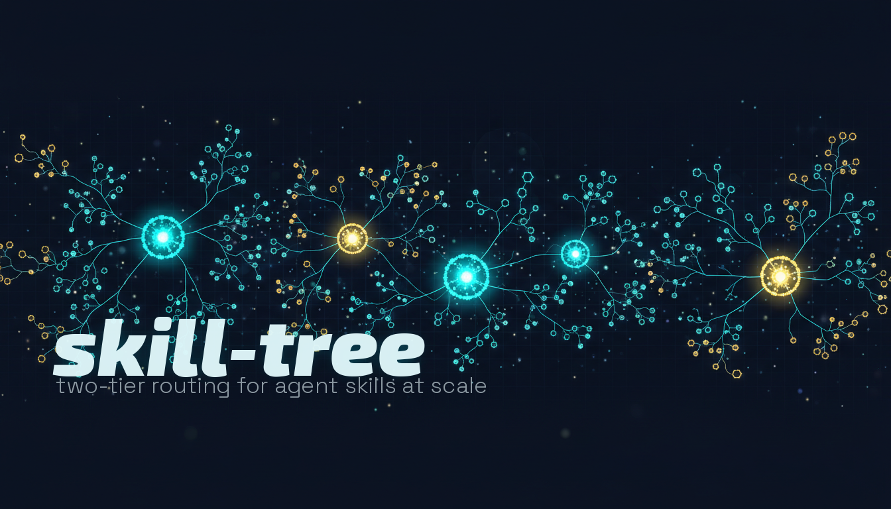

<p align="center">
  
</p>

# skill-tree

Manage agent skills you already have installed — across Claude Code, Codex CLI, and Gemini CLI.

Skills accumulate. After ~150 of them my prelude got noisy enough that Claude Code kept offering a flight-rewards skill while I was writing iOS code. `skill-tree` narrows the prelude to a small project-specific set, audits the install registries for the usual breakage (stale symlinks, lock-file drift, parallel registries), and documents how the skill system actually works so you can fix it when it breaks.

This is about progressive disclosure and management — not skill discovery. For discovery, see Anthropic's [`claude-code-setup`](https://github.com/anthropics/claude-plugins-official/tree/main/plugins/claude-code-setup) or [ComposioHQ/awesome-claude-skills](https://github.com/ComposioHQ/awesome-claude-skills).

Early. Mostly used by me. Tested on macOS, not Linux. Issues and PRs welcome.

## Commands

| Command | What it does |
|---|---|
| `/skill-tree:provision` | Pick a small set of skills that fit the current project. Copy them into `<project>/.claude/skills/` so the prelude stays focused. |
| `/skill-tree:audit` | Walk every skill registry on this machine. Report what's broken and the fix command per installer. |
| `/skill-tree:diagnose <symptom>` | "My new skill isn't appearing." "I get 'skill not found' for X." Match the symptom to a known failure-mode signature in `docs/ecosystem-map.md` and point at the fix. |
| `/skill-tree:sync` | Reconcile project skill copies after upstream library changes. |
| `/skill-tree:fetch <url>` | Download a skill from GitHub with security checks. New skills are sandboxed (`disable-model-invocation: true`) until you add them to a cluster. |
| `/skill-tree:check` | Health check on the manifest graph. |

## Install

Requires Python 3.11+ and [uv](https://docs.astral.sh/uv/).

**Claude Code**
```
claude plugin marketplace add danielbrodie/skill-tree
claude plugin install skill-tree@skill-tree
```

**Gemini CLI**
```
gemini extensions install https://github.com/danielbrodie/skill-tree
```

**Codex CLI**
```
# Clone somewhere stable, then register the repo root as a local marketplace
git clone https://github.com/danielbrodie/skill-tree ~/.codex/marketplaces/skill-tree
codex plugin marketplace add ~/.codex/marketplaces/skill-tree
# Enable the plugin in ~/.codex/config.toml
echo '[plugins."skill-tree@danielbrodie"]' >> ~/.codex/config.toml
```

Verified against codex-cli 0.130.0. Codex doesn't have a `plugin install` subcommand — registering the marketplace plus the `[plugins."..."]` block in `config.toml` is the activation. See `docs/codex.md` for caveats (no SessionStart hook surface, `${CLAUDE_PLUGIN_ROOT}` is Claude-specific).

**OpenClaw**
```
openclaw plugins install ./openclaw
```

## Per-project manifest

`<project>/.claude/.skilltree.json` records which skills got copied in and why:

```json
{
  "version": "1.0",
  "sourceLibrary": "~/.claude/skills",
  "syncedAt": "...",
  "skills": {
    "tdd": {
      "source": "~/.claude/skills/tdd",
      "reason": "Python+pytest repo",
      "syncedAt": "...",
      "sourceHash": "..."
    }
  },
  "auditLog": [...]
}
```

Skills are copied, not symlinked, so your project edits won't fight upstream library changes. `/skill-tree:sync` reconciles drift when you want it.

**Commit `.claude/skills/` and `.claude/.skilltree.json` to the project's repo.** The per-project skill set is meant to travel with the project — anyone who clones the repo gets the same focused prelude, and CI/other machines get the same skills without a global library. Manifest paths are stored `~`-relative (not absolute) precisely so the file is portable. The `sourceHash` lets `/skill-tree:sync` detect when a committed copy has drifted from whatever global library a given machine has.

## The docs

`docs/ecosystem-map.md` covers how skills actually work across Claude Code, Codex CLI, and Gemini CLI — load paths per platform, frontmatter that controls progressive disclosure, plugin cache lifecycle, failure-mode signatures and their fixes. Every load-path and frontmatter claim is cited to the corresponding platform's official documentation.

`docs/registry-map.md` covers where skills end up on disk per installer on macOS, and the safe-removal command per installer.

`docs/measurement.md` defines the Reach@catalog metric the provisioner is measured against, with a baseline run.

The audit and diagnose skills read these docs at runtime, so the docs are part of the tool, not just references sitting next to it.

PRs to any of them welcome.

## License

Apache 2.0
